# Klarart 

## Contents
[Website](Website)  
[Overview](Overview)  
[Wireframes](Wireframes)  
[Languages](Languages)  
[Testing](Testing)  
[Facebook](Facebook)
[Help](Help)  
[Bugs](Bugs)  
[Mentions](Mentions)  

# Website

# Overview
This is my project for portfolio project 5 with code institute. I decided to make an art e-commerce store as my wife is a talented artist, and I wanted to create something that I can actually utilise and help her create her own business. Creating an e-commerce site was both fun and challenging. It has helped me to understand more about the inner workings of django. A language of which I am very fond of. Using bootstrap has also given me a much needed refresher on html and css.
Having all of the bootstrap information and code gave me the ability to focus on more on the functionality of the website.

# Wireframes
 
I used wireframes to map out the basic structure of the website. It allowed me to have a visual plan,
so that I would not stray of course. The creation of the wireframes also helped me to have a preview
as to what works well and what doesn't work very well. Bellow are images of the wireframes I created 
for this project.
 

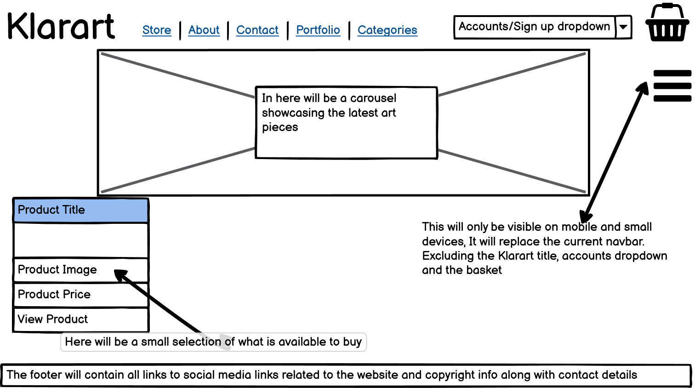

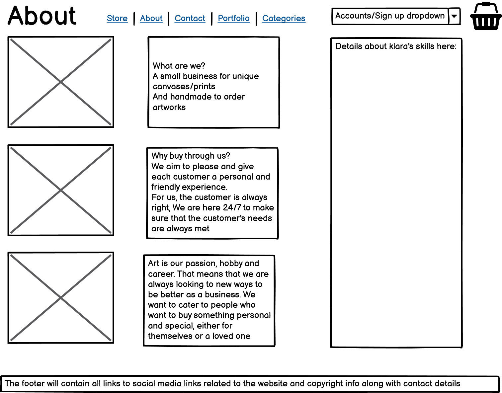

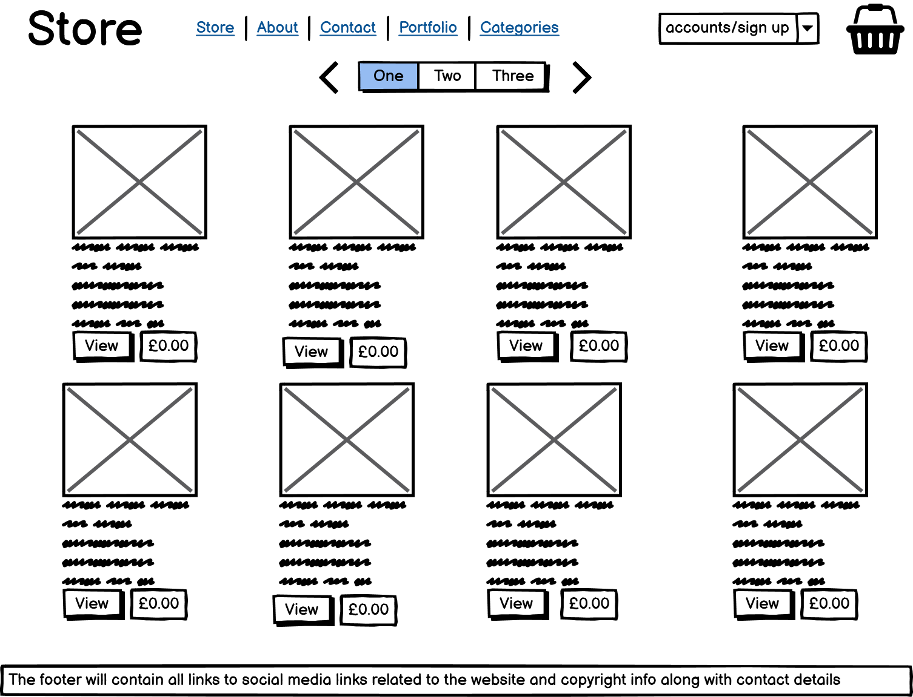

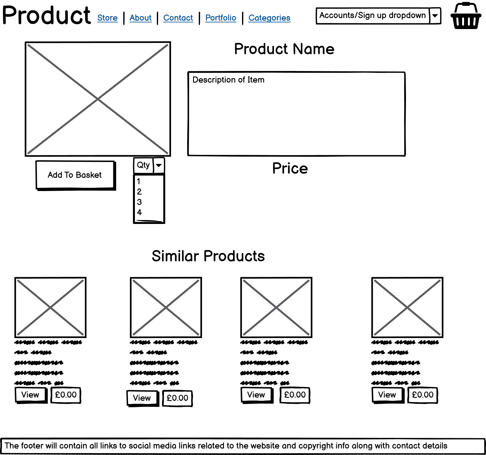

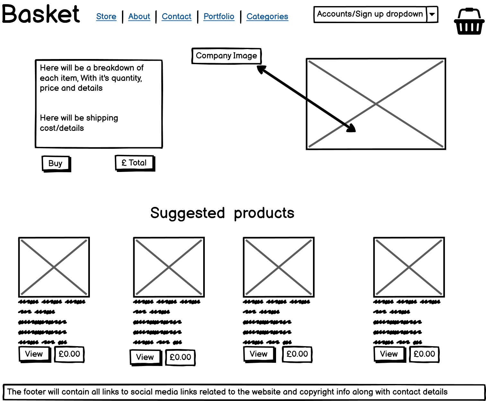

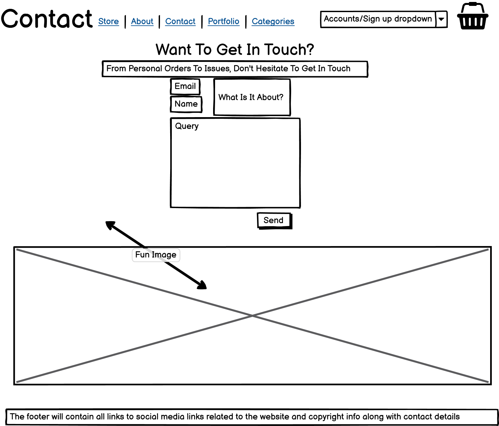

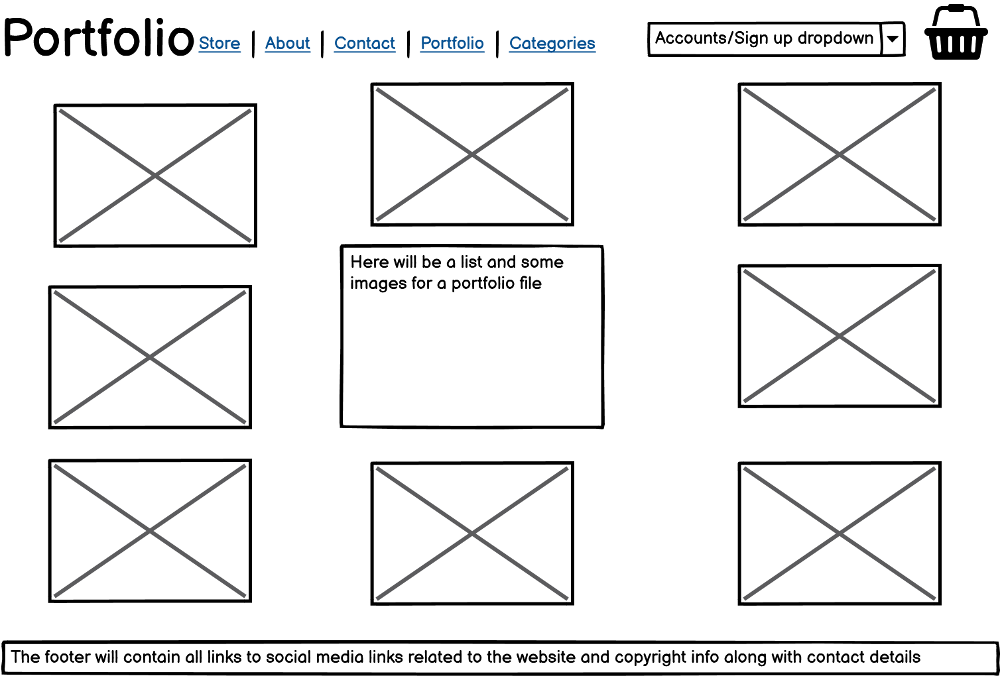

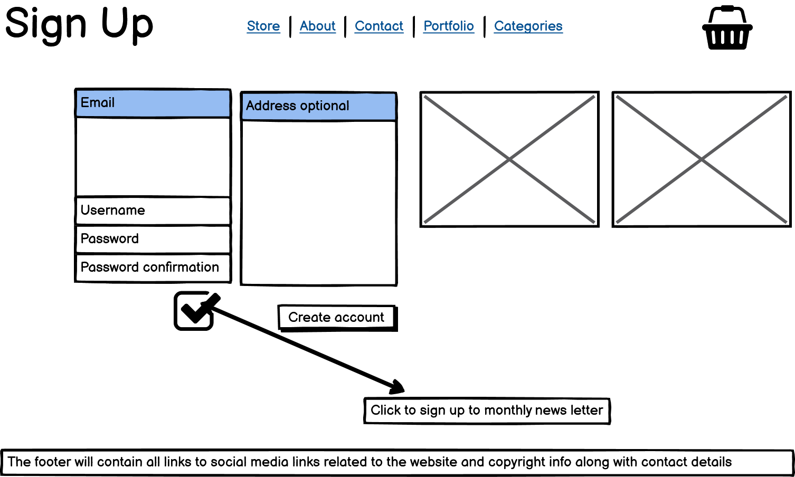

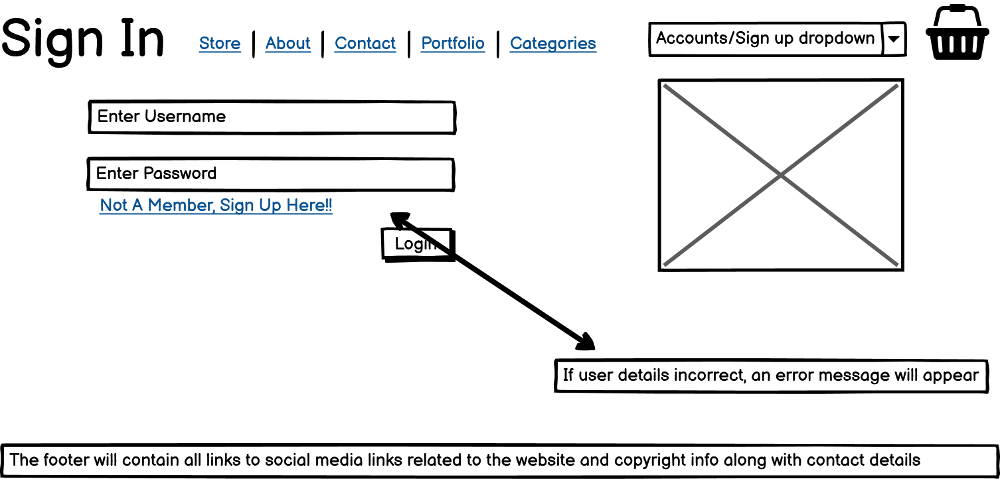

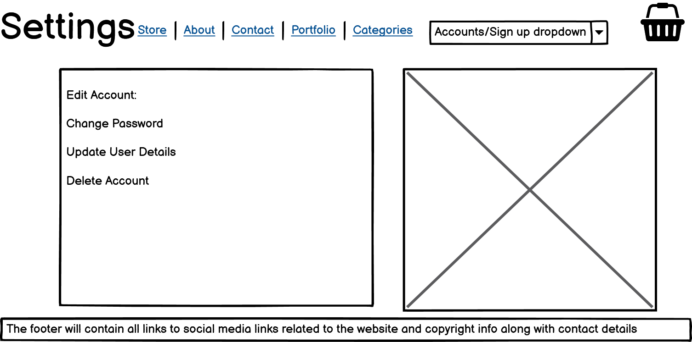

# Languages

# Testing

# Facebook
I created a facebook business page to go along with the website, As time goes on I will edit and grow the page to increase customer flow
 

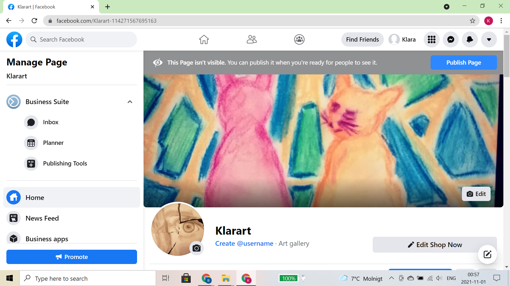

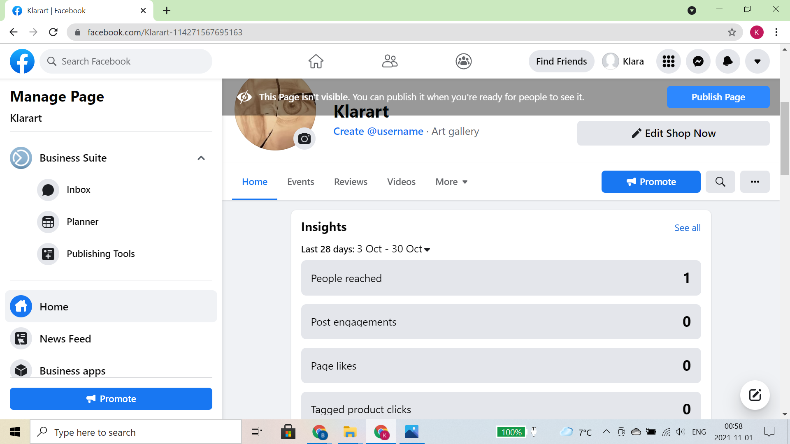

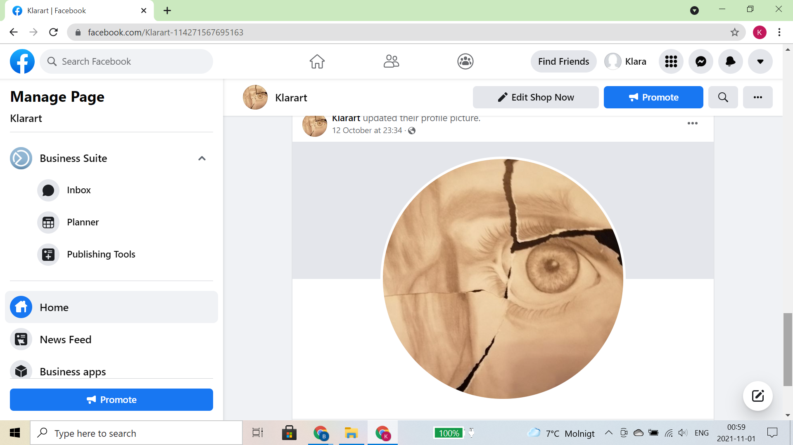

# Help

# Bugs

# Mentions

To Do:

Edit Login Page from bootstrap and make is more user friendly and more welcoming.

Create user Registration page and form

Create models for adding/removing/editing items on website

Create edit account feature for users

Create more personalized navbar

Add carousel to homepage to show featured products

Get categories dropdown functional

Create functional search bar

add products view and view all products page
(6 products per page)

Add contact section for users to get in touch

DEPLOY!!

add stripe payment system

create newsletter

create facebook business page